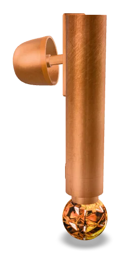

#### Project: AR Object with Hotspots
This project showcases a luxury earbuds design, featuring a nostalgic, jewelry-inspired theme with crystal installed. It includes interactive hotspots, annotations, and an immersive experience that combines fashion aesthetics with technology.

#### Installation
No installation required. Download the files to your computer and view in a compatible AR viewer or browser.

#### Contributing
1. Fork the repository
2. Create your feature branch
3. Commit your changes
4. Push to the branch
5. Submit a pull request

#### Credits
Sit Loi Pan (Roy Sit)

#### License
Copyright (c) 2024 Sit Loi Pan  
Permission is hereby granted, free of charge, to any person obtaining a copy of this software and associated documentation files (the "Software"), to deal in the Software without restriction, including without limitation the rights to use, copy, modify, merge, publish, distribute, sublicense, and/or sell copies of the Software, and to permit persons to whom the Software is furnished to do so, subject to the following conditions:  
THE SOFTWARE IS PROVIDED "AS IS", WITHOUT WARRANTY OF ANY KIND, EXPRESS OR IMPLIED, INCLUDING BUT NOT LIMITED TO THE WARRANTIES OF MERCHANTABILITY, FITNESS FOR A PARTICULAR PURPOSE AND NONINFRINGEMENT. IN NO EVENT SHALL THE AUTHORS OR COPYRIGHT HOLDERS BE LIABLE FOR ANY CLAIM, DAMAGES OR OTHER LIABILITY, WHETHER IN AN ACTION OF CONTRACT, TORT OR OTHERWISE, ARISING FROM, OUT OF OR IN CONNECTION WITH THE SOFTWARE OR THE USE OR OTHER DEALINGS IN THE SOFTWARE.

#### Element
1. Hotspot Elements: Placed clickable hotspots within the model that display annotations when clicked.
2. Hotspot Styling: Used custom styles for hotspots such as circular borders, shadows, hover effects, and visible/invisible toggling based on user interactions.
3. Event Handling: Added click event listeners to hotspots so that clicking displays the information related to each hotspot.
4. Click Outside to Close hotspots: Enabled a feature to close the annotation if users click outside the hotspot, improving user experience.
5. Annotation Toggling: Implemented a function to show/hide annotations.

THE END